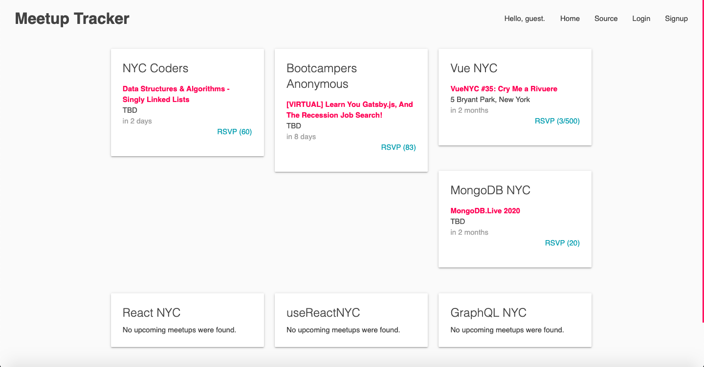

# Meetup Tracker

### Deployed Web App:

https://meetup-tracker.herokuapp.com

### Description:

Responsive web app that allows users to explore a curated list of upcoming tech meetups in New York City.

MVP completed in 2 days for a solo project.

### Tech Stack:

Built using Node.js, Express, PostgreSQL, and Sequelize on the backend, React, Redux, and Materialize.css on the frontend, and utilizes the Meetup API.

### Dev Team:

* Tal Luigi ([LinkedIn](https://www.linkedin.com/in/talluigi) | [GitHub](https://github.com/luigilegion))
